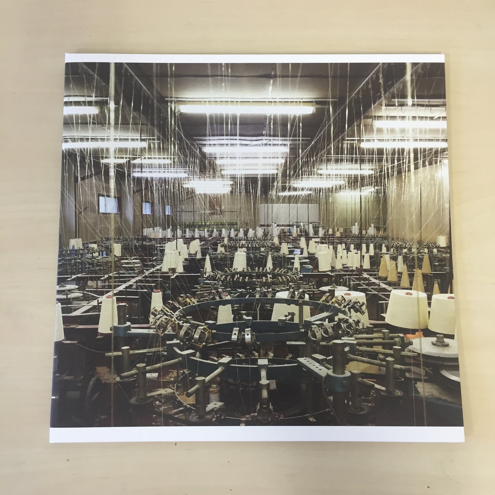
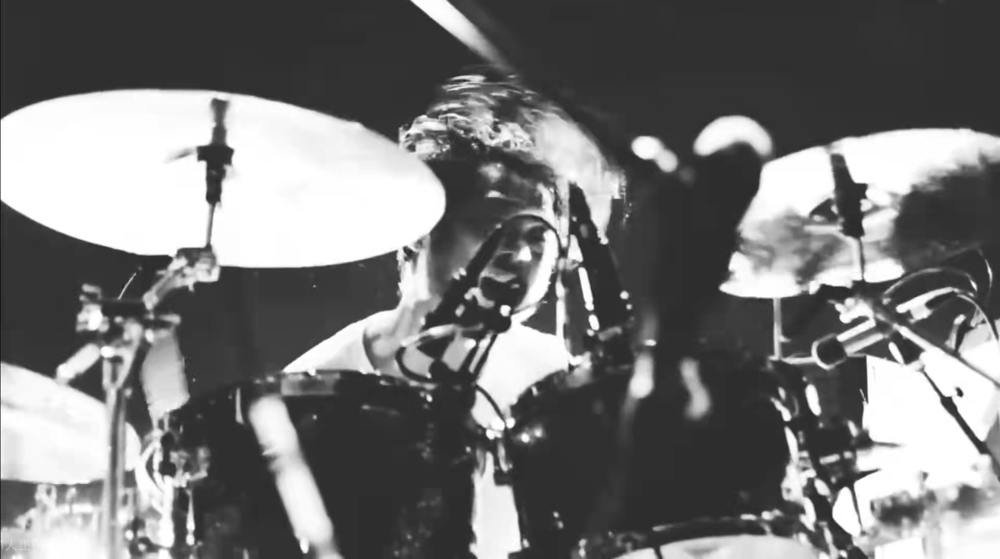
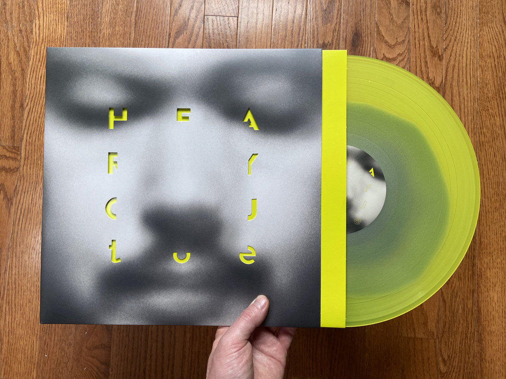

>  Toe是一个来自东京的日本后摇/数摇乐队。该乐队成立于2000年，成员包括：吉他：山嵜广和，美浓隆章，贝斯：山根敏史，鼓：柏仓隆史。

# 简介

Toe是一支数学摇滚乐队。这表明他们玩的并不广泛，在摇滚庞大的门类中他们只占据了其中一个相对冷门的分支。但就是在数学摇滚这一分支上，他们做到了登峰造极，直到现在我仍然可以说出，toe是我听过的最好的数学摇滚乐队。

## 首先，什么是数学摇滚？

> 数学摇滚，或称“数字摇滚”，是一种实验性的摇滚风格，80年代后期萌芽于美国。
> 数学摇滚曲风大多混合噪音摇滚、后摇滚、前卫摇滚、简约音乐、电子音乐等。它的一个特点是编曲复杂，经常使用不规则停顿或开始、不自然节拍结构、棱形旋律、对位法、延伸和弦、不协调和弦、非典型和弦进行。一般摇滚乐都以4/4 拍 作歌曲结构，而数学摇滚则频繁使用不对称节拍，如 7/8 拍, 11/8 拍, 13/8 拍，并于歌曲中交错换拍，例如一小段9/8 拍，转换至8/8 拍，再转换至6/8 拍，让听众有错摸的诡异感觉。 又例如，在同一首乐曲使用3/4 拍的鼓、4/4 拍的吉他、3/4 拍的低音吉他，却让每样乐器巧妙地于不同音轨上“对在一起”，听起来又顺畅不碍耳。因为此类乐曲节奏的复杂度被众多聆听者与乐评视为如同数学一般的特征，故有此名称。
>
> ——Google艺术与文化

咱们听歌的时候应该都会有数拍子的习惯，对于大多数歌曲而言，只需要数动次打次或者动打动打，然后跟着节奏抖腿就可以了。但对于数摇而言就没那么容易，数摇音乐节奏相当复杂，钟情于使用奇数拍，在你感觉这一小节还没有结束时就已经进入下一小节了；而且不同乐器往往也会在[同一时间进行不同的节拍](https://en.wikipedia.org/wiki/Polyrhythm)；更可怕的是也许这一小节是这个节拍，下一小节又转为另一种节拍，想要数清楚根本是不可能的事情。所以简而言之，如果你听到的音乐让你抖腿都不明白了，那其中就可以说是包含了数学摇滚的元素🤪。

那有人就要说了，一个音乐编曲这么乱我听个啥呢？

首先，乱虽然是数学摇滚的特征，但并不是它的目的。数学摇滚通常利用“重复”这一利器来抵消奇数拍和变拍所带来的陌生感。在同一时间内你可以听到多个吉他和贝斯在重复一小段旋律，从而共同构成复杂的和弦，而同时背景的鼓则在敲打着另一种节奏，二者在不断重复中的相互交错调谐没有带来新的复杂，却带来了一种新的和谐，就像数两个不同的数字，最终数到了他们的公倍数一样。这种新鲜的和谐感是一整曲都采用一把吉他一种节奏所不能带来的，是音乐之美的另一种表现形式。

其次，上文我们说“是音乐之美的另一种表现形式”，这是在说，音乐这种东西不只有一种表现形式，正是因为它本身的丰富性才能使音乐能够与其他艺术形式分庭抗礼。用常见的比喻来说，我们平日喜闻乐见的流行音乐只是音乐这冰山的一角，在其下还有更庞大的部分，其中包含着诸如无调性音乐、噪音等等我们甚至很难认为其是音乐的那些部分。这些部分的存在绝不是无意义的，就像发展物理学一样，人类在精神世界中的探索肯定也会向着更广更深的方向迈进，而这些就是音乐的更广更深的部分。这样看来，数学摇滚的特殊性只不过是从冰山顶往下挪了挪，巧妙地处在了“不能接受”和“没有新鲜感”的分界线上。在这种意义上，数学摇滚对于拓宽音乐审美范围这种目的而言是绝对值得一听的。

最后，数学摇滚很大程度上听的是一种“整体感”。咱们上面说了一大堆奇数拍怎么怎么特殊，但真正在聆听的时候我们很难去将注意力放在每一个错开的节拍上，我们听的效果往往是“打得很激烈的鼓和弹得很有感觉的吉他”混在了一起，构成了一种怪异而美妙的感觉。这种感觉大概就像你在看一道超级复杂的数学题时往往就很难集中在某一行字上，而是只能看到黑压压一大段一样的感觉（数 学 摇 滚）。所以这也许就是为什么很多时候会把数学摇滚与后摇、情绪硬核等注重表现氛围、情感的种类相提并论。但表现“情绪”自然不是数学摇滚的原教旨，很多数摇乐队积极地与爵士、实验等融合，会包含更多炫技的成分。

## 然后，toe为什么是神？

> 如果真的要把成军於2000年的Toe归纳在Post-Rock流派之下，那么他们所奏出的，就是如斯清雅雋永的后摇滚音乐，让鏗鏗鏘鏘而温婉动听的木结他，与丝丝入扣的低音结他及鼓击，作出调和的组合。意境上仿如乘座交通工具驶经日本市郊的公路，眼前是一片明媚而简朴的风光。 

toe的音乐的主要风格很明显：清新。对于摇滚乐队来说，这种风格并不算很常见——但这倒是很符合他们日本乐队的身份。toe的音乐中常用一把电吉他和一把民谣吉他，其中电吉他却并不是用来拉失真的，而是用于忠实的发出清亮的音色，演奏出一段段清新、隽永、或许还带着一些悲伤的Riff，不断重复，绵延贯穿整首音乐，就像一排不断被风吹起而发出清脆声音的风铃。

但toe不是民谣乐队，与主旋律的清新优雅相对，他们也有着相当“重型”的另一面：鼓。在上文我们提到过数摇的节奏相当复杂，因此一个数摇乐队中，必然会有一个乐器站出来承担这种复杂性，对于其他乐队而言可能是贝斯或吉他，但对于toe而言，就是鼓。toe的曲子中，鼓的表现绝对属于让人听过一遍就难以忘怀的程度，在保持着堪比技术死金属乐的速度与复杂程度的同时，鼓还承担了音乐的主心骨的作用，引领协调着乐队中处于不同节拍的乐器，最后还要在正常节拍的间隙中增加切音、错音等等细节——几乎是不可能的任务，但事实上就是做到了。第一次听toe的音乐，也许还没有记住旋律，但一定会领会到暴风骤雨般的鼓点所带来的震撼感。

说起鼓，便会将话题引领至toe的鼓手：柏仓隆史。toe是神的一个非常重要的原因是，这个乐队的鼓手柏仓隆史，是神。即使在强者如云的摇滚乐界中，柏仓隆史也依然享有极高的声誉，就是因为他能够做到如上所述的，常人无法完成之事。柏仓隆史的超神表现，直接导致了toe与其他数摇乐队、乃至其他摇滚乐队很不同的一点：toe的曲子中，鼓是占绝对主导的，如果有哪一段鼓不占主导了，那也是鼓将地位给吉他等乐器让出来的。

toe的曲子虽然风格清新，但这种清新没有退化为平淡，而是包含了一种热烈的激情。

# 专辑介绍

如果要给toe的专辑分座次的话，我个人的答案是：如果toe的水平有十成，那么《Goodbye》一曲占四成，《the book about my idle plot on a vague anxiety》占五成，剩下的曲子共占一成。

## the book about my idle plot on a vague anxiety

这张专辑封面上有着一只傻狍子的专辑是toe最好的作品之一（被称为“鹿头”，也即本文章的封面），也是世界上在数学摇滚这个范畴内数得上号的优秀专辑。为什么有底气这么说呢，因为美国的音乐杂志曾经评选过最好的100张数摇专辑，该专辑能排到前三。

《past and language》是鹿头中我最喜欢的一首，这首曲子中的吉他和鼓的表现都极其优秀，可以说是真正做到了相辅相成。

## For long tomorrow

这张专辑同样也是toe的力作之一，与鹿头一样有着极高的声誉。虽然该专辑可能整体质量上稍逊于鹿头，但它强就强在其中包含着toe的巅峰之作：《Goodbye》。在上面对Toe的个人评价中，我甚至将这一首曲子赋予了堪比鹿头的地位。鹿头已然是神中之神，区区一首曲子何能及君也？因为，首先在长度上，Goodbye 7分钟就比所有的曲子都要长（这是个什么理由😅），更长的曲子给了toe更大的发挥空间，让他们能够更好的规划曲段、铺垫情感，同时也给了柏仓隆史更多的机会来整花活。

其次，与鹿头中很多曲子没有明显的情感倾向不同，goodbye有着相当强烈的情感表现，这使得即使是从后摇角度而言这依然是一首神作。

如果感兴趣的话，请务必观看此演唱会版本：https://www.bilibili.com/video/BV1yJ411v7Gv ，绝对会是丰富人生的一种体验。

柏仓隆史

当然，这张专辑里还包含着另一首非常值得一听的曲子：《Two Moon》。这首曲子的曲风相当温柔，让人甚至怀疑真的是这帮大老爷们写出来的吗🤣。作为主旋律的吉他在整曲的不同部分中中重复着不同的Riff，温婉而动听，配合上背景中另一把吉他的和声以及（似乎是）三角铁的叮叮当当的声音，让你仿佛感觉在一个温度刚刚好的夏夜出门散步，听着偶尔的蝉鸣声与夜晚寂静的风声。作为背景的鼓在曲子的中间部分才开始出现，但并不带有其一贯的侵入性，而是仿佛轻轻挽起身边人的手一般，与吉他一起将整曲的情感表现轻柔的抬高，最终到达曲末的高潮。高潮部分与Goodbye的高潮有几分相似，都是让吉他引入新的旋律，同时将吉他和鼓的表现力同时增强一个等级，二者相互交错，将情感推至顶峰。但与Goodbye的孤独不同，Two Moon在高潮部分爆发出的情感更像是“电视剧的男女主终于在一起”了感觉，融入了更多的美好。

那么，Two Moon，两个月亮，是哪两个呢？夏目漱石为月色赋予了浪漫的含义，因此，第一个月亮便是真正在天上的月亮；而第二个月亮，对于我而言，便是眼前的她。对于你而言是什么呢？你会有自己的答案。

## hear you

《hear you》是toe比较新的作品，在2015年发售，与它在05年的鹿头和09年的tomorrow老前辈来说，可以算是年轻小生了。

# 最后，说说感受

在b站toe的某个演唱会视频下，某人对toe给出了这样一个评价：

> toe总是一场无可抑制的梦。

我觉得这句话很好的概括出了toe带给人的两种主要感受。无可抑制的，是激情，是被旋律和鼓点所牵引的，热烈的，爆发式的情感——但这终究是一个梦。在梦里，无论是喜悦还是悲伤，都往往能够产生出非常强烈的情感，而作为代价的便是在醒来的那一刻，现实生活中的空气所带来的怅然若失。

> There is no one can understand me
>
> Truly i do not go out and i will keep silence
>
> Everyone is mania in general
>
> You don't have To know others
>
> 
>
> It's more complex than how i used to thought
>
> Already i know The start is the end
>
> Everyone is mania in general
>
> You don't have time to sleep for To know others
>
> 
>
> うまく届かないんだ (Umaku todokanai nda)
>
> また 次の不安か? (mata tsugi no fuan ka?) 
>
> A disruption and blinder
>
> その先はないんだ (Sono-saki wa nai nda)

