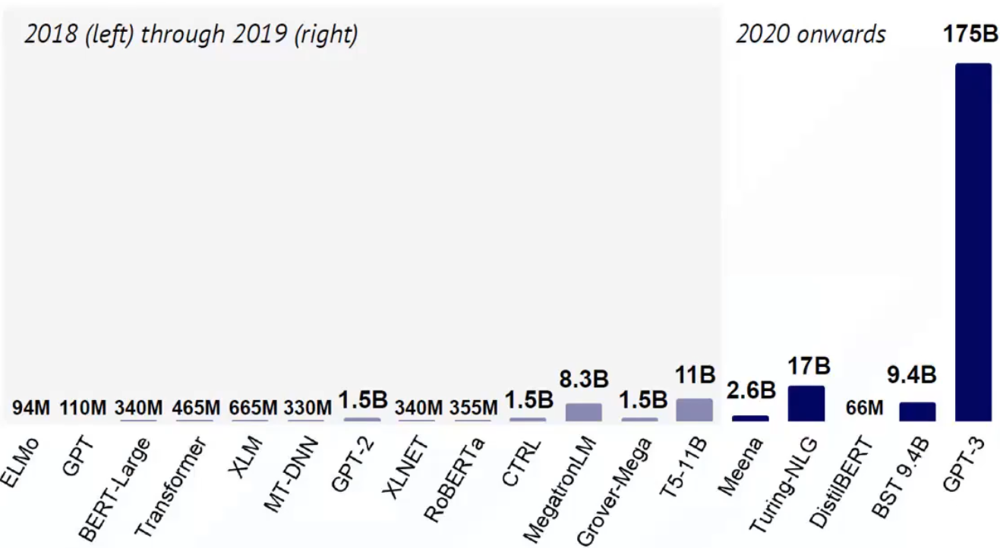

> 记录一下今年ASC22的一些见闻，可能并不具有指导意义。
>
> <!-- end -->

# 简介

二等奖耶😇

今年的题说实话出的相当nt，因为浪潮一直是ASC的赞助商，所以今年浪潮干脆就拿他们最新的科研（氪金）成果拿来出了道题。尽管题目里写的是训练个“小的”Yuan模型，但浪潮仿佛是一个浪荡许久的花花公子已经对金钱的数量没有了概念一般，将要求的模型参数出的巨大无比，导致这个模型需要将近160多G显存，一般的显卡组乃至实验室服务器都装不下。所以最后迫不得已的我们还是倒向了GPU平台（小广告：https://autodl.com），用14块3一个小时的价格租了6块24G的3090，才勉强装下。6块！也许这次这个模型，就是我这辈子能亲自训练的最大模型了罢。

——好吧，也许我不应该喷浪潮的。毕竟是哪个学校的ASC队伍现在（指2022年之前）还没有学校内的GPU服务器可用呢？我不好说。

从2017年谷歌发布了transformer结构后，NLP界的军备竞赛就开始了。

## 显存需求

https://zhuanlan.zhihu.com/p/31558973

模型的显存占用主要分为两个部分：模型本身的参数占用，以及模型的输出数据占用。

模型参数占用分为：

* 有参数的层，比如卷积、全连接，`BatchNorm`等等带状态的层（与池化层这样的单纯做运算的层区分）。这些层的空间占用跟它的形状相关。

* 梯度、动量等参数。优化器在更新参数时需要利用梯度信息，如果是带动量的优化器则同时需要保存动量信息，如最简单的动量SGD：
    $$
    v_{t + 1} = \rho v_t + \nabla F(W_t)\\
    W_{t + 1} = W_t - \alpha v_{t + 1}
    $$
    其中的$\nabla F(W_t)$和$v_t$都是需要保存的，这两部分的矩阵大小与参数矩阵是相同的，因此相当于参数大小乘了几倍。

采用`fp16`之后，模型的每个参数都需要占用2个字节（如果`fp32`则是4个字节）。

对于GPT模型而言，占用大小计算方法为：
$$
memory\ cost = parameters \times 16 + activation \times batch\ size\\
activation = seqlen \times hidden\ size
$$
如上公式可以计算一个下界值，还有可能需要额外的空间来存储临时变量等。

# 调参技巧

可以说，在这里即将写下的一些技巧，每一条都是用钱堆出来的🤣。在没有上手之前，我对于模型调参是纯纯的理论派，虽然能念念什么正则化学习率策略动量的经，但不过对于实际中该如何设置还是一无所知的。这次倒是真的实践出真知了，每调一次超参数都得实验一次，实验一次就是十几块钱出去了，这种感觉让人相当心惊胆战。

# `Infiniband`

