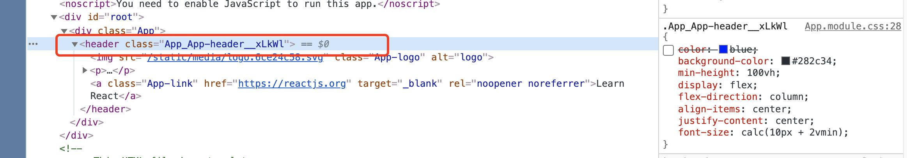
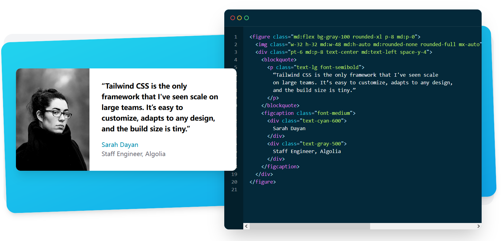

> 本文主要介绍一下现代前端开发中有关CSS的相关知识，以及在React项目中该如何方便的写CSS。
>
> <!-- end -->

# 传统CSS面临的问题

传统的HTML、JS和CSS开发中，我们将内容、样式与行为分开看待，编写CSS的过程为：

1. 通读HTML文件；
2. 给某个指定的DOM元素起class名或id名；
3. 在CSS文件中选中该类名；
4. 为该类名赋予样式。

之所以有这样的步骤，是因为传统的网页以静态内容为主，写CSS的过程其实相当于你在给一个word文档添加粗体斜体颜色等格式的过程，注重的是给整个文档排版。

但时过境迁，在现代Web开发中我们更注重动态内容的交互，因此为文档排版而生的传统CSS方案变得不再使用，具体而言有如下的问题：

* 现代的Web框架使用了组件化的开发思想，很多时候你编写的HTML代码片段代表的不是一个文档，而只是一个小按钮、一个表单等组件，所以**这时候仍然遵循“命名-选择-写样式”这样的方式未免太过麻烦**；
* 现代Web框架均为[单页应用](https://zh.wikipedia.org/wiki/%E5%8D%95%E9%A1%B5%E5%BA%94%E7%94%A8)，最终的成果中只有一个HTML文件，所有的样式表将会被引入其中，这会导致**命名污染**的问题：在两个不同的组件中使用了相同的class名称，这时**双方的样式将会互相影响，而这不是我们想要的行为，与组件化的思想相悖**；
* CSS代码与HTML是强耦合的，且不同层级之间的CSS会互相影响，几乎扭成了一团乱麻，这导致：
    * 我们几乎无法想象要共享一段带样式的HTML代码将会是多么麻烦；
    * CSS之间相互纠缠导致我们无法按需加载CSS。

这些问题呼唤着我们去使用更加现代化的CSS方案。

# 第一步：CSS预处理器

CSS实在是太“基础”了，它本身并不是一个编程语言，因此变量等语言特性都是没有的，这给现代的动态网站开发带来了很多麻烦。因此有人提出了一种方案，增加一层“编译器”，就是将CSS本身当作一种类似于汇编的东西，我们在编写的时候编写的是高级语言（Less，Sass），在最终应用的时候在编译到底层语言（也就是CSS）。

但CSS本身没有那么复杂，所以我们不将这个东西叫做“编译器”而叫做**[预处理器](https://zh.wikipedia.org/zh-hans/%E9%A2%84%E5%A4%84%E7%90%86%E5%99%A8)（preprocesser）**。这样的方案主要有[LESS](https://less.bootcss.com/)、[SASS](https://sass-lang.com/)等。

# 基本思想：模块化CSS

上面说的CSS预处理器解决的是CSS太过底层的问题，但本身却没有解决CSS命名污染的问题。为了解决污染，一个很自然的思想是：如果CSS也能够模块化、组件化，那就能够与现代开发方式契合了。所以[CSS Modules](https://github.com/css-modules/css-modules)应运而生，通过这种方式，我们将CSS样式局限在一个组件中，而其他组件则不会受到当前组件的影响。

```css
/* style.module.css */
.component {
  color: green;
}
```

```react
import styles from "./style.module.css";

export default () => {
    return <div className={styles.component}>114514</div>
}
```

在Vue中则为：

```vue
<template>
    <div class="button-warp">
        <button class="button">text</button>
    </div>
</template>
...
<style scoped>
    .button-warp {
        display:inline-block;
    }
    .button {
        padding: 5px 10px;
        font-size: 12px;
        border-radus: 2px;
    }
</style>
```

> CSS Module的实现方式其实没有想象的复杂：通过CSS Module方式写的CSS也会经过预处理过程，预处理完毕后将会在类名后面加上一段随机值，从而使得即使类名相同，所对应的样式也是不同的。
>
> 

# 加速主义：CSS-in-JS

最后到了我们最激进的CSS方案：CSS-in-JS。这种方案倡导将CSS完全写在JS代码里面。

这种方式对于写React的我们而言其实没有那么难以接受，毕竟咱已经在JS里面写HTML了，那在JS里再写CSS也不是那么不可理喻——但即使理论上说是这样，这种方案也收到了很多质疑，很多React程序员认为这样的方案会导致代码的阅读体验很差，混在一起不好辨别。

如果让我说的话，我是CSS-in-JS的忠实拥趸，使用这种方案不仅不会降低可读性，而且将会极大程度的提升写React代码的幸福感，并且与React的组件思想很好的契合。

现在比较流行的CSS-in-JS方案为[Emotion](https://emotion.sh/docs/introduction)和[styled-component](https://styled-components.com/)，这里演示一下styled-components的用法：

```react
const Button = styled.a`
  display: inline-block;
  border-radius: 3px;
  padding: 0.5rem 0;
  margin: 0.5rem 1rem;
  width: 11rem;
  background: transparent;
  color: white;
  border: 2px solid white;

  /* The GitHub button is a primary button
  ${props => props.primary && css`
    background: white;
    color: black;
  `}
`

export default () => {
    return <Button className="button"> button </Button>
}
```

`a`还是那个`a`，只不过现在是自带样式的了。

# 回归本心：原子类

原子类这个东西说起来非常简单：你不是说class name会污染吗，那好，我直接污染到底，我将每一个CSS属性都浓缩在一个class name中，要给某段HTML添加样式的时候，我就将所有用到的样式都作为class name写进来，这样的话每个组件的样式就都是不一样、没有污染的啦。

——听着蛮怪的。

确实很怪，世界上的其他人也是这么想的。这个方案与人工智能技术一样，诞生的很早，但生不逢时。人工智能的思想是因为以前的计算能力没有发展起来，从而无法获得发展；而原子类思想则是因为组件化的思想还没有流行，因此也不被人重视。

所幸，好时代来临了，因此原子类的思想重新焕发了生机，但换了个名字：[Tailwind CSS](https://www.tailwindcss.cn/)。tailwind的自我介绍为：

> Tailwind CSS 是一个功能类优先的 CSS 框架，它集成了诸如 `flex`, `pt-4`, `text-center` 和 `rotate-90` 这样的的类，它们能直接在脚本标记语言中组合起来，构建出任何设计。

使用的样子为：



可以看到，class name那里是长长的一串，其中每一个都代表着一个CSS的属性。

这种现代化CSS自然比原子类方案有一定的改进。具体的体现为：

* 由于class name和CSS样式是一一对应的，所以我们很容易通过某个类名写出**规范的**样式，比如宽度只有`w-2`，`w-4`这样的类名，box shadow只有`shadow-md`，`shadow-lg`这样的类名——这样的话就不用费心的写`width: 3.1415926 px`或者`box-shadow: 2px 2px 2px 1px rgba(0, 0, 0, 0.2);`了；
* 现代网页首先面对的是移动端适配，因此tailwind很识相的提供了类似于`md: w-2 lg: w-4`这样的响应式前缀，几乎能够无痛的进行移动端适配，同时还提供了`dark: bg-black`这样的暗黑模式；
* tailwind提供了`@apply w-4 h-6`这样的方式，能够将一些样式抽取出来构成一个新的类名，因此样式提取也变得非常简单。

这些好处都比较冠冕堂皇，比较接地气的好处就是：爽，写的时候不用自己起类名、在js和CSS之间换来换去，然后写出长长的CSS语句，而是直接在React中一把梭，几乎不用怎么动脑子就能写出很棒的样式，所以推荐大家都试一下。

如果还是想问这种方式真的好用吗，那[本页面就是用tailwind写的](https://github.com/observerw/oldspaper)，可以自行查看一下源码。

